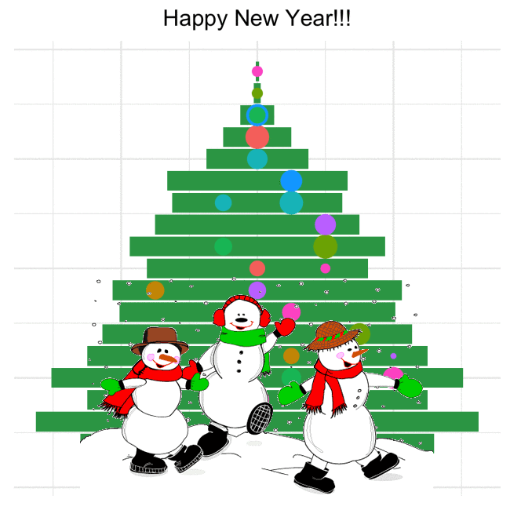

```{r, out.width = "100px", echo=FALSE}

```
```{r, out.width = "100px", echo=FALSE}
knitr::include_graphics("Rlogo.png")
```


```{r setup, include=TRUE}
library(ggplot2)
library(magick)
```

```{r, warning=FALSE, message=FALSE, echo=TRUE}


# Jeroen Kromme, December 25, 2016. Christmas Three with ggplot. blog post. Retrieved from:
# http://www.theanalyticslab.nl/2016/12/25/christmas-tree-with-ggplot/
# create data
x <- c(5, 5.2, 6.5, 5, 6.05, 5, 4.55, 4.05, 4.25, 3.25, 3.75, 3, 2.5, 2.65, 1.5, 1, 0.5, 0.1, 0.05)

dat1 <- data.frame(x1 = 1:length(x), x2 = x)
dat2 <- data.frame(x1 = 1:length(x), x2 = -x)
dat1$xvar <- dat2$xvar <- NA
dat1$yvar <- dat2$yvar <- NA
dat1$siz <- dat2$siz <- NA
dat1$col <- dat2$col <- NA

# set threshold for christmas balls
dec_threshold = -0.65

# create random places, sizes and colors for christmas balls
set.seed(173)
for (row in 1:nrow(dat1)){
  
  if (rnorm(1) > dec_threshold){
    
    dat1$xvar[row] <- row
    dat1$yvar[row] <- sample(1:dat1$x2[row]-1,1)
    dat1$siz[row] <- runif(1,0.25,1.75)
    dat1$col[row] <- sample(1:8, 1)
  }
  
  if (rnorm(1) > dec_threshold){
    
    dat2$xvar[row] <- row
    dat2$yvar[row] <- sample(1:dat2$x2[row],1)
    dat2$siz[row] <- runif(1,0.5,1.5)
    dat2$col[row] <- sample(1:8, 1)
  }
}

# The image_graph() function opens a new graphics device similar to e.g. png() or x11(). 
# It returns an image objec to which the plot(s) will be written
fig <- image_graph(width = 400, height = 400, res = 96)

# plot and save the christmas tree
ggplot() +
  geom_bar(data = dat1, aes(x=x1, y=x2),stat = "identity", fill = '#31a354') +
  geom_bar(data = dat2, aes(x=x1, y=x2),stat = "identity", fill = '#31a354') +
  geom_point(data = dat1,aes(x = xvar, y = yvar, size = siz, colour = as.factor(col)) ) +
  geom_point(data = dat2,aes(x = xvar, y = yvar, size = siz, colour = as.factor(col)) ) +
  coord_flip() + theme_minimal()+ theme(legend.position="none",
                                        axis.title.x=element_blank(),
                                        axis.text.x=element_blank(),
                                        axis.ticks.x=element_blank(),
                                        axis.title.y=element_blank(),
                                        axis.text.y=element_blank(),
                                        axis.ticks.y=element_blank()) +
  ggtitle('Happy New Year!!!') +
  theme(plot.title = element_text(hjust = 0.5)) +
  ggsave('~/Documents/my_R/NewYear2018/ggplot_image.png') 

# read snowman gif file
ny_gif <- image_read("http://www.animatedimages.org/data/media/277/animated-snowman-image-0105.gif")  
#
# Background image
graph_bg <- image_read("~/Documents/my_R/NewYear2018/ggplot_image.png")
background <- image_background(image_scale(graph_bg, "650"), "white", flatten = TRUE)
# Combine and flatten frames
frames <- image_apply(ny_gif, function(frame) {
  image_composite(background, frame, offset = "+102+350")
})
# Turn frames into animation
animation <- image_animate(frames, fps = 10)
print(animation)
```





Copyright © [www.DataTeka.com](www.datateka.com)
